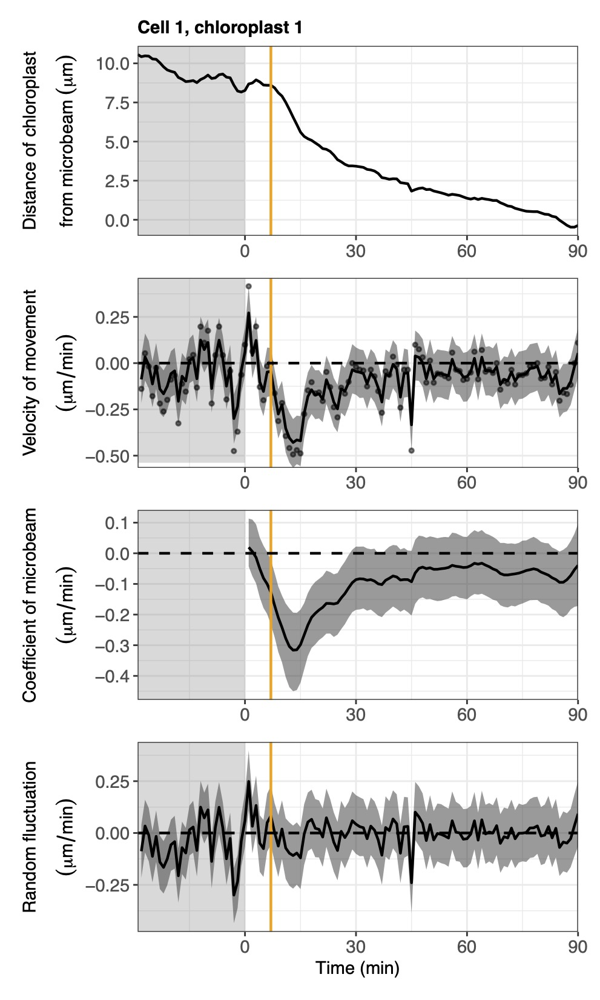

<!-- README.md is generated from README.Rmd. Please edit that file -->

# cellssm: State-space Modeling for the Directional Movement of Cells

<!-- badges: start -->
<!-- badges: end -->

## Overview

The R package cellssm provides an easy way to analyze the time-series of
distances of cells or organelles from an external stimulus. Using this
package, you can estimate the true dynamics from noisy movement data,
extract the common dynamics among multiple cells or organelles, and
estimate the start time of movements.

## Details

You just need to prepare csv files containing these colums: time (min,
sec, etc), presence of stimulus (0 or 1), and distances of cells from
the stimulus (mm,
m,
etc). Main functions are based on the Bayesian inference of parameters
in the state-space model including the time-varying coefficient of
regression.

## Installation

You can install the development version of cellssm from
[GitHub](https://github.com/) with:

``` r
# install.packages("devtools")
devtools::install_github("hnishio/cellssm")
```

## Example

A real data example of chloroplast accumulation responses to a blue
microbeam:

``` r
# Load packages
library(cellssm)

# Set the path to which CmdStan was installed
cmdstanr::set_cmdstan_path("~/cmdstan/")

# Load data of chloroplast movements
data("cell1", "cell2", "cell3", "cell4")
cell_list <- list(cell1[,1:3])
# This is for a chloroplast in a cell as an example.
# If you want to run the modeling for multiple data frames, execute:
# cell_list <- list(cell1, cell2, cell3, cell4)

# Execution of state-space modeling
ssm_individual(cell_list = cell_list, out = "02_ssm_individual",
               res_name = "chloroplast", ex_name = "microbeam",
               unit1 = "micrometer", unit2 = "min")
```



This figure is an example of the output files. Dots, solid lines and
shaded regions are the observed values, median and 95% credible
intervals of the Bayesian inference, respectively. Orange solid lines
represent the start time estimated by the model. Shaded and light
regions represent the period without and with the explanatory variable,
respectively.
