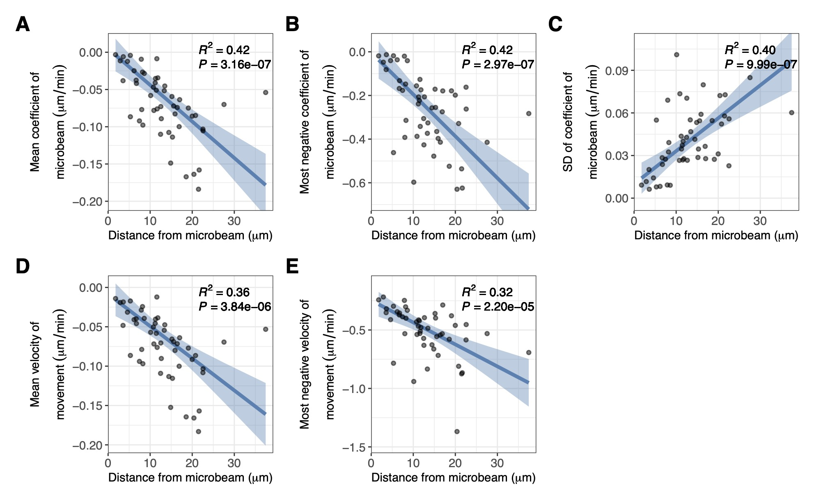
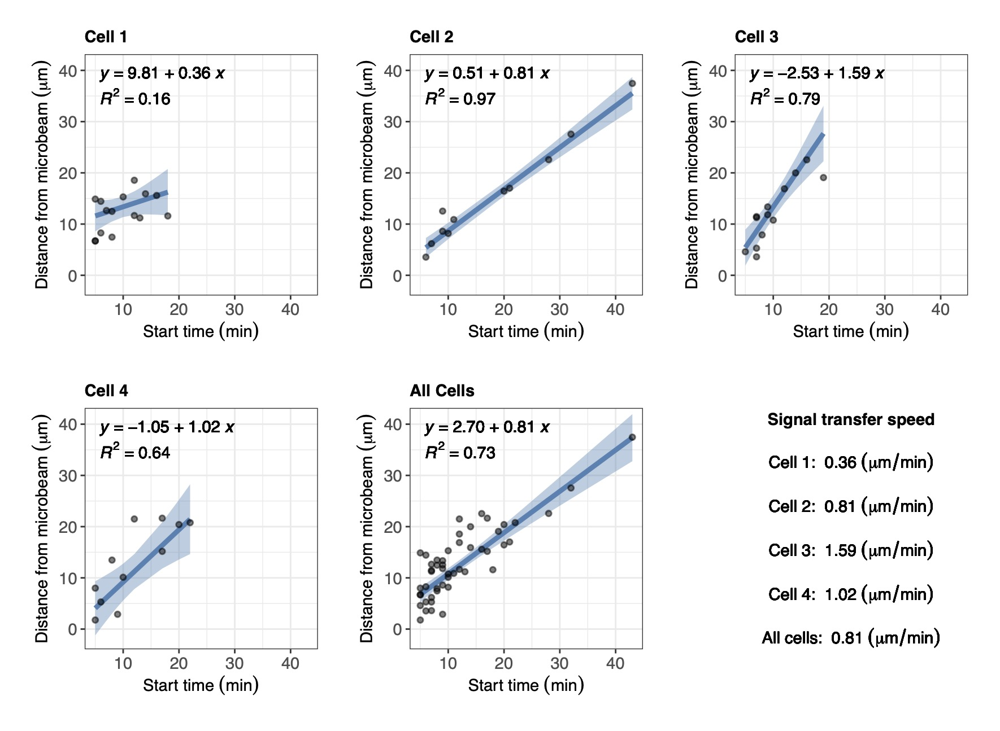
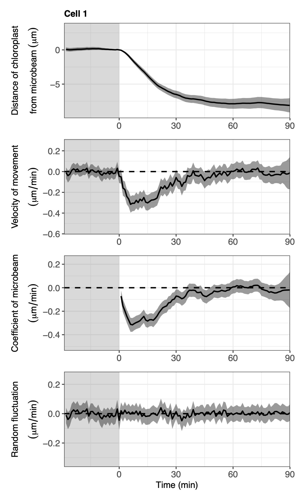

<!-- README.md is generated from README.Rmd. Please edit that file -->

# cellssm: State-Space Modeling for the Directional Movement of Cells

<!-- badges: start -->
<!-- badges: end -->

## Overview

An easy way for molecular biologists to analyse the time series of
distances of cells or organelles from an external stimulus. Using this
package, one can estimate the true dynamics from noisy movement data,
extract the common dynamics among multiple cells or organelles, and
estimate the start time of the movements.

## Details

The package only requires the preparation of csv files containing the
columns time (min, sec, etc.), presence of stimulus (0 or 1), and
distance of cells from the stimulus (millimeter, micrometer, etc.). The
main functions are based on the Bayesian inference of the parameters in
the state-space model, including the time-varying coefficient of
regression. This package consists of main functions to implement
state-space modelling, and sub-functions to perform minor tasks.

#### Main functions:

-   ssm_individual : Bayesian inference of the state-space model for
    individual dynamics
-   ssm_common : Bayesian inference of the state-space model to extract
    common dynamics
-   ssm_KFAS : Inference of the state-space model for individual
    dynamics using Kalman filter
-   nomodel : Estimation of movement without the state-space model

## Installation

You can install the development version of cellssm from
[GitHub](https://github.com/) with:

``` r
# install.packages("devtools")
devtools::install_github("hnishio/cellssm")
```

## Model definition of the state-space model (individual model)

We assumed that the distances of the target cells or organelles from the
explanatory variable (light, heat, etc.) was broken down into their
random walk and the effect of the explanatory variable. The explanatory
variable was supposed to affect the velocity of the targets, which
changed the location as a result. The state-space model to analyse the
time-varying effect of the explanatory variable on the velocity of
movement was defined by the equations:

\$\$\$\$

where *w*\[*t*\] is the white noise at the time *t*, *ex*\[*t*\] is the
absence and presence of the explanatory variable at the time *t*
represented by 0 and 1, respectively, $\beta$<sub>*ex*</sub>\[*t*\] is
the time-varying regression coefficient of an explanatory variable at
the time *t*, $\alpha$\[*t*\] is the true state of velocity of movement
at the time *t*, *y*\[t\] is the observed velocity of movement at the
time *t*, and $\sigma$<sup>2</sup> is the variance.
*t*<sub>*start*</sub>, *t*<sub>*on*</sub>, *t*<sub>*off*</sub> and
*t*<sub>*end*</sub> are time at the start of the time-course, the start
of the explanatory variable, the end of the explanatory variable and the
end of the time-course. *t* = (*t*<sub>*start*</sub>, ⋯ ,
*t*<sub>*on*</sub>, ⋯, *t*<sub>*off*</sub>, ⋯, *t*<sub>*end*</sub>) is
the time point at one unit interval.

## Model definition of the state-space model (common model)

In this model, we assumed an imaginary chloroplast which had a distance
from the microbeam of zero, and dynamics referred to as the “common
dynamics” for each cell. The state-space representation of the common
dynamics is similar to that of the “individual model” explained in the
previous section. We then assumed that the real dynamics of all
chloroplasts followed the common dynamics after the start time estimated
for each chloroplast by the “individual model”. The state-space
representation of the “common model” is defined by the equations:

\$\$

where *w*\[*t*\] is the white noise at time *t*; *ex*\[*t*\] is the
absence and presence of the explanatory variable at time *t* represented
by 0 and 1, respectively; $\beta$<sub>*ex, common*</sub>\[*t*\] is the
common time-varying regression coefficient of the explanatory variable
at time *t*; $\beta$<sub>*ex, each*</sub>\[*t, n*\] is the time-varying
regression coefficient of the explanatory variable at time *t* in the
response variable *n*; $\alpha$<sub>*common*</sub>\[*t*\] is the common
velocity of movement at time *t*; $\alpha$<sub>*each*</sub>\[*t, n*\] is
the estimated velocity of movement at time *t* in the response variable
*n*; *y*\[*t, n*\] is the observed velocity of movement at time *t* in
the response variable *n*; *dist*<sub>*common*</sub>\[*t*\] is the
distance of the response variable from the explanatory variable at time
*t*; and $\sigma$<sup>2</sup> is the variance. *t*<sub>*start*</sub>,
*t*<sub>*on*</sub>, *t*<sub>*off*</sub>, and *t*<sub>*end*</sub> are
time at the start of the time-course, the start of the explanatory
variable, the end of the explanatory variable, and the end of the
time-course. *t* = (*t*<sub>*start*</sub>, ⋯ , *t*<sub>*on*</sub>, ⋯,
*t*<sub>*off*</sub>, ⋯, *t*<sub>*end*</sub>) is the time point at one
unit interval.

## Workflow example (chloroplast accumulation responses to a blue microbeam)

#### Bayesian inference of the state-space model (individual model)

``` r
# Load package
library(cellssm)
#> Welcome to cellssm
# Load data of chloroplast movements
data("cell1", "cell2", "cell3", "cell4")
cell_list <- list(cell1, cell2, cell3, cell4)
# Check the format of the input data
cell_list[[1]][1:5, 1:5]
#>   time ex chloroplast1 chloroplast2 chloroplast3
#> 1  -29  0     10.56522     13.49660     7.313553
#> 2  -28  0     10.42622     13.54386     7.500186
#> 3  -27  0     10.47938     13.38559     7.662217
#> 4  -26  0     10.46126     13.33824     6.946221
#> 5  -25  0     10.28293     13.38516     6.870312
cell_list[[1]][116:120, 1:5]
#>     time ex chloroplast1 chloroplast2 chloroplast3
#> 116   86  1   -0.1888778     4.326590     3.076194
#> 117   87  1   -0.3558449     4.272946     2.994293
#> 118   88  1   -0.4725642     4.300817     2.995619
#> 119   89  1   -0.4725642     4.300817     2.995619
#> 120   90  1   -0.3623979     4.356912     2.958912
```

``` r
# Set the path where CmdStan was installed
cmdstanr::set_cmdstan_path("~/cmdstan/")
# Execution of state-space modelling
ssm_individual(cell_list = cell_list, out = "02_ssm_individual",
               res_name = "chloroplast", ex_name = "microbeam",
               unit1 = "micrometer", unit2 = "min")
```


This figure is an example of the output files: Bayesian inference of the
state-space model for a chloroplast in cell 1. The observed distance of
the chloroplast from the blue microbeam (first panel), the observed and
inferred velocity of movement (second panel), the inferred coefficient
of the blue microbeam (third panel), and the inferred random
fluctuations of the velocity (last panel) are shown. Dots, solid lines,
and shaded regions are the observed values, medians, and 95 % credible
intervals of the Bayesian inference, respectively. Orange solid lines
represent the start time estimated by the model. The shaded and light
regions represent the period without and with the explanatory variable
(a blue microbeam), respectively.

#### Robust linear regression (x: distance at time 0, y: coefficient of explanatory variable or velocity)

To test if the velocity of chloroplast movement during transport depends
on the distance from the blue microbeam at the start of irradiation,
repeated median regression can be performed.

``` r
# Load data
data("chloroplast_mvtime")
# Check the format of the input data
chloroplast_mvtime[1:5,]
#>   cell chloroplast start_time end_time move_time
#> 1    1           1          6       38        32
#> 2    1           2          7       52        45
#> 3    1           3          5       18        13
#> 4    1           4          8       41        33
#> 5    1           5          5       45        40
```

``` r
# Specify the path of the output directory of [ssm_individual] or [ssm_KFAS]
# Below, the path of the system files is specified to provide an example
ssm_file <- stringr::str_split(system.file("extdata", "individual_model.stan",
                                           package = "cellssm"), "/")[[1]]
ssm_path <- paste(ssm_file[-length(ssm_file)], collapse = "/")
# Linear regression
glist <- lm_dist_beta(cell_list = cell_list, mvtime = chloroplast_mvtime,
                      ssm_path = ssm_path,
                      ssm_method = "Bayes", res_name = "chloroplast",
                      ex_name = "microbeam", unit1 = "micrometer", unit2 = "min")
(glist[[1]] + labs(tag = "A")) + (glist[[2]] + labs(tag = "B")) + (glist[[3]] + labs(tag = "C")) + 
  (glist[[4]] + labs(tag = "D")) + (glist[[5]] + labs(tag = "E")) +
  patchwork::plot_layout(nrow = 2)
```



**A**–**E** Repeated median regression of the mean coefficient of
microbeam during the time course (**A**), the most negative coefficient
of microbeam (**B**), the standard deviation of coefficient of microbeam
(**C**), the mean velocity of movement (**D**), and the most negative
velocity of movement (**E**), against the distances of chloroplasts from
the blue microbeam at the start of irradiation. In **A**–**E**, dots,
solid lines and shaded regions are the observed values, regression lines
and 95% confidence intervals, respectively.

#### Estimation of the signal transfer speed by linear regression (x: start time, y: distance at time 0)

``` r
# Linear regression
glist <- lm_signal(cell_list = cell_list, mvtime = chloroplast_mvtime,
                   ex_name = "microbeam", unit1 = "micrometer", unit2 = "min")
glist[[1]] + glist[[2]] + glist[[3]] + glist[[4]] + glist[[5]] + glist[[6]] +
   patchwork::plot_layout(ncol = 3)
```



Linear regression of the distance of chloroplast from a blue microbeam,
against the start time estimated by the Bayesian inference. The speed of
signal transfer was defined as the slope of regression lines. Dots,
solid lines and shaded regions are the observed values, regression lines
and 95% confidence intervals, respectively.

#### Bayesian inference of the state-space model (common model)

``` r
# Load data of chloroplast movements
data("cell1", "cell2", "cell3", "cell4", "chloroplast_mvtime")
cell_list <- list(cell1, cell2, cell3, cell4)
```

``` r
# Set the path where CmdStan was installed
cmdstanr::set_cmdstan_path("~/cmdstan/")
# Execution of state-space modelling
# With the data frame of the movement time. This is recommended.
ssm_common(cell_list = cell_list, mvtime = chloroplast_mvtime, out = "08_ssm_common",
          res_name = "chloroplast", ex_name = "microbeam",
          unit1 = "micrometer", unit2 = "min")
```



This figure is an example of the output files: Bayesian inference of the
state-space model assuming the common dynamics between chloroplasts for
cell 1. The estimated values of the distance of the chloroplast from the
blue microbeam (first panel), the velocity of movement (second panel),
the coefficient of the blue microbeam (third panel), and the random
fluctuations of the velocity (last panel) are shown. Solid lines and
shaded regions are the medians and 95 % credible intervals of the
Bayesian inference, respectively. The shaded and light regions represent
the period without and with the explanatory variable (a blue microbeam),
respectively.
